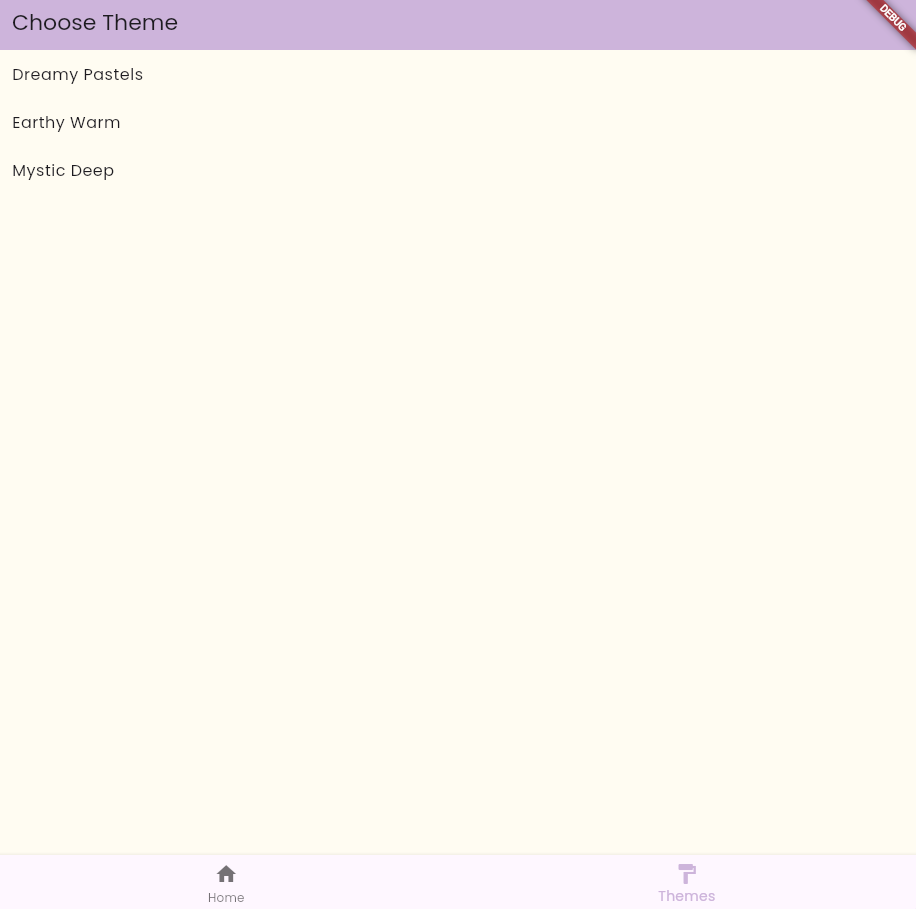

# 🎨 Hobbs

## 📖 Description
The **Hobbs** is a Flutter-based mobile application that uses the **Gemini API** 🤖 to recommend hobbies based on user preferences. The app prompts users with 5 questions 📝, collects their answers, and generates 2-4 personalized hobby recommendations 🎯. Each recommendation is displayed on the result screen with a description 📋 and a personalized explanation from the AI. It also supports theme switching 🎨 with 3 color palettes and a navigation bar for smooth navigation.

## ✨ Features
- 💬 **Interactive Questions**: Prompts users with 5 personalized questions.
- 🤖 **AI-Powered Recommendations**: Uses Gemini API for hobby suggestions.
- 🧠 **Personalized Reasoning**: AI explains why a hobby suits the user.
- 🎨 **Theme Switching**: Choose between Light, Dark, and Custom themes.
- 💡 **Minimal & Animated UI**: Clean design with subtle animations.

## 🗂️ Folder Structure
```
lib/
├── main.dart              # Entry point of the app
├── hobby_service.dart     # Logic for AI hobby generation
├── gemini_service.dart    # Handles Gemini API calls
├── screens/
│   ├── home_screen.dart
│   ├── question_screen.dart
│   ├── result_screen.dart
├── theme/
│   └── theme_data.dart
└── widgets/
    ├── custom_card.dart
    ├── question_card.dart
    └── expandable_card.dart
```

## 🔄 Workflow
1. **🏠 Home Screen**
   - Welcome message + navigation button
   - Theme-switching nav bar 🌈

2. **❓ Question Screen**
   - Displays 5 questions for the user
   - Submit navigates to results 🚀

3. **🏁 Result Screen**
   - Shows user answers 💬
   - 2–4 hobby cards with description + AI reasoning 🧠

4. **🎨 Theme Switching**
   - Easily toggle Light, Dark, and Custom themes via nav bar

## 🚀 Getting Started
To run the app locally:

```bash
git clone 
https://github.com/RohanXD/hobbyfinder
flutter pub get
flutter run
```

## 🎨 Themes
Choose from three visually pleasing themes:

1. 🌞 **Light Theme** – Pastel, soft, calming
2. 🌚 **Dark Theme** – Sleek, night-friendly
3. 🌈 **Custom Theme** – Vibrant and unique

## 🖼️ Screenshots

### 🏠 Home Screen


### ❓ Question Screen


### 🧠 Result Screen


### 🎨 Theme Switcher


## 🧰 Libraries & Tools
- `flutter` – App development
- `animated_background` – Visual animation effects
- `simple_animations` – Smooth transitions
- `blur` – UI blur effects
- `lottie` – Lottie animations
- `google_fonts` – Font customization
- `http` – API calls to Gemini

Made with ❤️ using Flutter & Gemini AI

