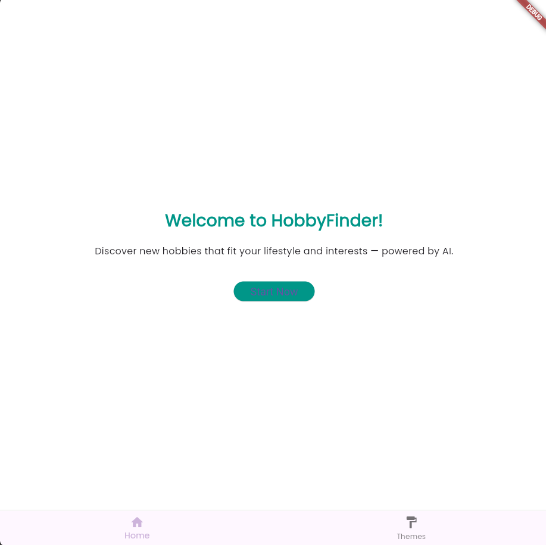
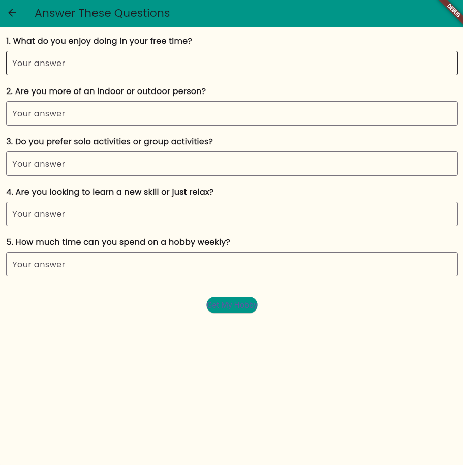

# Hobby Recommender App
Hobby Recommendation System

## Description
The Hobby Recommender App is a Flutter-based mobile application that uses the Gemini API to recommend hobbies based on user preferences. The app prompts users with 5 questions, collects their answers, and generates 2-4 personalized hobby recommendations. Each hobby recommendation is displayed on the result screen with a description and a personalized explanation from the AI about why the hobby suits the user. The app also includes a theme-switching feature with 3 color palettes and a navigation bar for easy navigation.

## Features
- **User Interaction**: Asks users 5 predefined questions to determine their preferences.
- **AI Integration**: Uses the Gemini API to generate hobby suggestions based on user answers.
- **Result Screen**: Displays each hobby in a separate card, with a description and a personalized reason generated by the AI.
- **Theme Switching**: Supports 3 distinct color palettes that can be switched via a navigation bar.
- **Light and Minimalistic UI**: The app uses smooth animations and a clean, minimal design.

## Folder Structure
Here’s the folder structure for the app:

```
lib/
├── main.dart              # Entry point of the app
├── hobby_service.dart     # Contains logic for fetching hobby recommendations from the Gemini API
├── gemini_service.dart    # Handles communication with the Gemini API
├── screens/
│   ├── home_screen.dart   # Displays the home screen
│   ├── question_screen.dart  # Displays the screen with questions
│   ├── result_screen.dart   # Displays the result screen with hobby suggestions
├── theme/
│   ├── theme_data.dart    # Contains theme data and switching logic
└── widgets/
    ├── custom_card.dart   # Custom widget for displaying hobby cards
    ├── question_card.dart # Custom widget for displaying each question
    └── expandable_card.dart # Custom widget for displaying expandable hobby cards
```

## Workflow
1. **Home Screen**:
    - Displays a welcome message and a button to navigate to the Question Screen.
    - Also includes a navigation bar with theme-switching options for users to toggle between Light, Dark, and Custom themes.

2. **Question Screen**:
    - Displays 5 predefined questions, where the user can input their answers.
    - Upon submitting, the app navigates to the Result Screen.

3. **Result Screen**:
    - Displays the user’s answers and 2–4 hobby suggestions as expandable cards.
    - Each hobby card includes a description and a personalized explanation from the Gemini API on why the hobby suits the user.

4. **Theme Switching**:
    - The app allows users to toggle between 3 themes (Light, Dark, and Custom) via a navigation bar in the Home Screen and throughout the app.

## Screenshots

### Home Screen


### Question Screen


### Result Screen


### Theme Switcher


## How to Run the App
1. Clone the repository:
   ```bash
   git clone https://github.com/RohanXD/hobbyfinder
   ```

2. Install dependencies:
   ```bash
   flutter pub get
   ```

3. Run the app:
   ```bash
   flutter run
   ```

## Theme Switching
The app supports 3 different color themes, each with its own unique palette. You can switch themes using the navigation bar located at the top of the app.

### Available Themes:
1. **Light Theme**: Uses soft pastel colors for a calming, light experience.
2. **Dark Theme**: Uses darker tones for a more focused, low-light experience.
3. **Custom Theme**: A custom theme that combines vibrant colors for a dynamic look.

## Libraries Used
- `flutter`: The main framework for building the app.
- `animated_background`: For adding animated backgrounds to the app.
- `simple_animations`: To implement smooth animations for UI elements.
- `blur`: For adding blur effects to certain parts of the UI.
- `lottie`: For integrating Lottie animations.
- `google_fonts`: For adding Google Fonts to the app.
- `http`: For making HTTP requests to the Gemini API.

## License
This project is licensed under the MIT License - see the [LICENSE](LICENSE) file for details.

